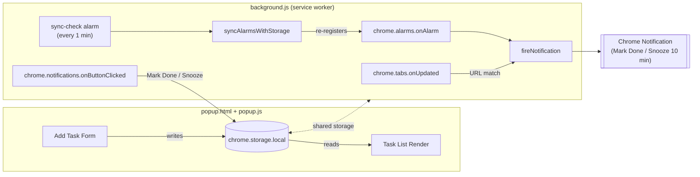

#  RightInfo
# ⏱️ Right Info, Right Time
 
**A lightweight task & reminder assistant that lives inside your browser toolbar.**
 
Capture a task the instant you think of it. Get reminded exactly when — or *where* — it matters. No app-switching, no forgetting.
 
[](./manifest.json)
[](#-browser-compatibility)
[](#-technology-stack)
[](#-license)
[](#-contributing)
 
</div>
---
 
## 📖 Table of Contents
 
- [Why This Project Exists](#-why-this-project-exists)
- [Problem Statement](#-problem-statement)
- [Key Features](#-key-features)
- [Extension Architecture](#-extension-architecture)
- [Folder Structure](#-folder-structure)
- [Technology Stack](#-technology-stack)
- [Installation](#-installation)
- [Usage](#-usage)
- [Permissions](#-permissions)
- [Privacy & Security](#-privacy--security)
- [How Reminders Work Internally](#-how-reminders-work-internally)
- [Troubleshooting](#-troubleshooting)
- [Roadmap](#-roadmap)
- [Known Limitations](#-known-limitations)
- [Contributing](#-contributing)
- [License](#-license)
---
 
## ✨ Why This Project Exists
 
People don't forget *that* they need to do something — they forget *when* and *where*. A message to send "in 10 minutes," a video to watch "later tonight," a task tied to a specific site you'll reopen anyway. These in-the-moment intentions live scattered across whatever tab you happen to be in, and switching to a separate to-do app to log them almost always breaks focus — and often means the task never gets written down at all.
 
**Right Info, Right Time** was built to close that gap: click the toolbar icon, type the task, keep browsing. The extension remembers so you don't have to.
 
## 🎯 Problem Statement
 
- Time-bound intentions are generated constantly while browsing, but there's no low-friction place to capture them.
- Opening a full to-do app (Notion, Todoist, Google Tasks) breaks flow — most people abandon that habit within days.
- Some tasks aren't tied to a *time* at all — they're tied to a *place* ("remind me next time I'm on this site").
- The result: missed tasks, reactive scrambling, and the mental overhead of trying to "hold" reminders in your head.
## 🧩 Key Features
 
| Feature | Status | Description |
|---|---|---|
| **Toolbar quick-add** | ✅ Implemented | Click the extension icon → a compact "+ Add Task" panel opens inline in the popup, no page reload or navigation. |
| **Trigger-URL tasks** | ✅ Implemented | Attach an optional trigger URL to a task (e.g. `facebook.com`). The next time you land on a matching page, a notification fires automatically. |
| **Task list view** | ✅ Implemented | A flat, scrollable list of all tasks in the popup, each showing its text and (if set) its trigger link. |
| **Native browser notifications** | ✅ Implemented | Fires a Chrome notification with **Mark Done** and **Snooze 10 min** action buttons — no need to reopen the popup. |
| **Snooze from notification** | ✅ Implemented | Snoozing reschedules the task 10 minutes out using `chrome.alarms`, and the task list shows a ⏰ snoozed state. |
| **Mark done / delete / bulk-clear** | ✅ Implemented | Toggle a task complete with an animated checkbox, delete a single task, or clear all completed tasks (with a confirmation dialog for "remove all"). |
| **Persistent local storage** | ✅ Implemented | All tasks are stored via `chrome.storage.local` and survive browser restarts — no login required. |
| **Alarm re-sync on startup** | ✅ Implemented | On install and browser startup, snoozed alarms are re-registered, and any alarm missed by under a minute (e.g. the browser was closed) is fired immediately on relaunch. |
| **Test notification button** | ✅ Implemented | A "Test Notify" button lets you confirm Chrome notification permissions are working, independent of any task. |
| **Natural time-phrase parsing** (`in 10 minutes`, `at 7 PM`, `tomorrow`) | 🚧 In Progress | A standalone parsing module (`timeParser.js`) already understands relative and absolute time phrases, but it is not yet wired into the popup UI — see [Known Limitations](#-known-limitations). |
| **Recurring tasks, tags, cross-device sync, analytics** | 🗺️ Planned (PRD) | Explicitly out of scope for v1. See [Roadmap](#-roadmap). |
 
 
## 🌐 Browser Compatibility
 
| Browser | Support |
|---|---|
| Google Chrome | ✅ Fully supported (primary target, Manifest V3) |
| Microsoft Edge (Chromium) | ✅ Expected to work (Chromium-based, untested) |
| Brave | ✅ Expected to work (Chromium-based, untested) |
| Opera | ⚠️ Untested |
| Firefox | ❌ Not supported yet (Manifest V3 differences; post-MVP per PRD) |
| Safari | ❌ Not supported |
 
## 🛠 Extension Architecture
 
The extension is a plain Manifest V3 Chrome extension — no build step, no bundler, no framework. It's made up of three cooperating pieces that talk to each other through `chrome.storage.local` and `chrome.runtime.onMessage`:
 

 
**How it fits together:**
 
- **`popup.html` / `popup.js`** — the UI. Handles adding tasks, rendering the task list, toggling completion, deleting tasks, and clearing completed tasks. Reads/writes directly to `chrome.storage.local`.
- **`background.js`** — the service worker. Watches for tab navigation (`chrome.tabs.onUpdated`) to detect trigger-URL matches, listens for `chrome.alarms` to fire time-based (snoozed) reminders, builds and displays notifications, and handles the **Mark Done** / **Snooze** button clicks.
- **`timeParser.js`** — a standalone, dependency-free module that parses phrases like `in 10 minutes`, `at 7 PM`, or `tomorrow` into a timestamp. It is loaded by neither `popup.html` nor `background.js` today (see [Known Limitations](#-known-limitations)), but is ready to be wired in for full natural-language scheduling.
- **`style.css`** — a single dark-themed stylesheet (`Inter` font via Google Fonts) shared by the popup.
## 📂 Folder Structure
 
```
Rightinfo-main/
├── manifest.json      # Manifest V3 config: permissions, popup, service worker, CSP
├── background.js       # Service worker — alarms, notifications, URL-trigger matching
├── popup.html          # Popup markup (toolbar UI)
├── popup.js            # Popup logic — add/list/toggle/delete tasks, toasts, confirm dialog
├── timeParser.js        # Standalone natural-language time parser (not yet wired in)
├── style.css            # Popup styling (dark theme, Inter font)
├── R.png                 # Extension icon (16/32/48/128) and popup logo
└── README.md             # This file
```
 
No `src/`, `dist/`, or build output directories exist — the four `.js`/`.html`/`.css` files above are loaded by Chrome as-is.
 
## 📦 Technology Stack
 
| Layer | Choice |
|---|---|
| Language | Vanilla JavaScript (ES6+), HTML5, CSS3 |
| Framework | None — no React/Vue/Vite, plain DOM APIs |
| Extension Platform | Chrome Extension, **Manifest V3** |
| Background Execution | Service Worker (`background.js`) |
| Storage | `chrome.storage.local` (no backend, no database) |
| Scheduling | `chrome.alarms` API |
| Notifications | `chrome.notifications` API |
| Fonts | Google Fonts (`Inter`), loaded via CDN `<link>` in `popup.html` |
| Package Manager | None (no `package.json` — no npm dependencies) |
| Build Tool | None (no bundler/transpiler step) |
| Authentication | None — no accounts, no login, fully local |
 
## 🚀 Installation
 
No build step is required — this is a plain, unbundled Manifest V3 extension.
 
1. **Clone the repository**
```bash
   git clone https://github.com/<your-username>/Rightinfo-main.git
   cd Rightinfo-main
```
2. **Open Chrome extensions page**
   Navigate to `chrome://extensions`.
3. **Enable Developer Mode**
   Toggle **Developer mode** in the top-right corner.
4. **Load the extension**
   Click **Load unpacked** and select the project folder (the one containing `manifest.json`).
5. **Pin it**
   Click the puzzle-piece icon in Chrome's toolbar and pin **Right Info, Right Time** for one-click access.
That's it — no `npm install`, no environment variables, no build command.
 
## 🧭 Usage
 
1. Click the toolbar icon to open the popup.
2. Click **+ Add Task**, type your task (e.g. `Review pull request`).
3. *(Optional)* Add a **trigger URL** (e.g. `github.com`) — the extension will notify you the next time you open a matching page.
4. Press **Add**. The task appears in the list immediately, and storage is updated via `chrome.storage.local`.
5. When a trigger fires — or a snoozed reminder's alarm goes off — a native Chrome notification appears with **Mark Done** and **Snooze 10 min** buttons.
6. From the popup, tap the circular checkbox to mark a task complete, or the **×** on hover to delete it.
7. Use **Remove Done** to clear completed tasks in bulk (or clear everything, with a confirmation prompt, if none are marked done).
8. Use **Test Notify** at any time to confirm Chrome notification permissions are working correctly.
## 🔒 Permissions
 
Declared in `manifest.json`:
 
| Permission | Why it's needed |
|---|---|
| `storage` | Persist tasks locally via `chrome.storage.local` so they survive browser restarts. |
| `notifications` | Display native reminder notifications with action buttons (Mark Done / Snooze). |
| `alarms` | Schedule reliable, non-blocked background timers for snoozes and periodic sync (`chrome.alarms`, not `setTimeout`, which Manifest V3 service workers can silently discard). |
| `tabs` | Read the URL of the currently loading tab (`chrome.tabs.onUpdated`) to detect trigger-URL matches, and open trigger links in a new tab from the popup. |
 
The extension does **not** request `host_permissions`, `<all_urls>`, or `activeTab` scraping — it only reads tab URLs already exposed to `chrome.tabs.onUpdated` and never reads page content.
 
## 🛡 Privacy & Security
 
- **No accounts, no login, no backend server.** Everything runs entirely inside your browser.
- **No data leaves your device.** All tasks and trigger URLs are stored only in `chrome.storage.local` on the machine where the extension is installed.
- **No analytics or telemetry** are collected or transmitted.
- **Content Security Policy** (`manifest.json`) restricts scripts to `'self'` and only allows stylesheets/fonts from Google Fonts (`fonts.googleapis.com`, `fonts.gstatic.com`) — no third-party script execution.
- **No cross-device sync** — a task added in one Chrome profile stays in that profile only.
## ⚙️ How Reminders Work Internally
 
Right Info, Right Time supports two independent triggering mechanisms:
 
**1. Time-based (via `chrome.alarms`)**
Currently reachable through the **Snooze 10 min** notification button, which computes a new timestamp, stores it on the task, and calls `chrome.alarms.create(taskId, { when })`. A periodic `sync-check` alarm runs every minute to re-register any alarm that should exist but doesn't (e.g. after a browser restart), and to immediately fire any reminder that was missed by less than 60 seconds while the browser was closed.
 
**2. Site-based (via `chrome.tabs.onUpdated`)**
If a task has a trigger URL, `background.js` listens for tab navigation events. When a tab finishes loading, its URL is normalized (protocol/`www.`/trailing-slash stripped) and checked for a substring match against each task's stored trigger URL. On a match, a notification fires once per tab per task (tracked in an in-memory `Map` so the same tab doesn't re-notify repeatedly), unless the task is completed or currently snoozed.
 
Both paths converge on the same `fireNotification()` function, which builds a `chrome.notifications.create()` call with **Mark Done** / **Snooze 10 min** buttons, handled by `chrome.notifications.onButtonClicked`.
 
## 🧪 Troubleshooting
 
**Notifications aren't appearing**
Use the **Test Notify** button in the popup first. If that also fails, check your OS-level notification settings for Chrome, and confirm Chrome's own site/extension notification permissions haven't been blocked.
 
**A trigger-URL task never fires**
Trigger matching is a case-insensitive substring match on the *cleaned* URL (no protocol, no `www.`, no trailing slash). Make sure the trigger URL you entered is actually a substring of the page you expect to land on (e.g. `github.com/your-org` will not match `github.com` alone unless you visit that exact path).
 
**A snoozed task didn't fire while my laptop was asleep/closed**
The background sync check re-registers alarms and fires anything missed by under a minute when Chrome next starts up or the extension reloads — but a reminder missed by more than a minute while Chrome wasn't running will not retroactively fire exactly on time.
 
**The popup doesn't open**
Reload the extension from `chrome://extensions` (the refresh icon on the extension card), and check the **Errors** button on that card for any console output.
 
## 🗺 Roadmap
 
Reflects both the current implementation and the [Product Requirements Document](./PRD_RightInfoRightTime.md) for this project.
 
**In Progress**
- [ ] Wire `timeParser.js` into the popup so typed time phrases (`in 10 min`, `at 7 PM`) schedule a `chrome.alarms` reminder directly from task creation, matching the original MVP spec.
**Planned (per PRD, post-MVP)**
- [ ] Automatic tab context capture (URL/title) attached to a task without manual entry
- [ ] Recurring/repeating tasks (daily, weekly)
- [ ] Categories/tags for filtering
- [ ] Quick-add templates/snippets
- [ ] Cross-device sync via account login
- [ ] Weekly analytics/insights (completed vs. missed, time-of-day patterns)
- [ ] Custom notification sounds and toolbar badge counts
- [ ] Firefox/Edge store packaging beyond Chromium compatibility
**Explicitly out of scope for v1** (per PRD Section 9): user accounts, AI-generated task suggestions or auto-scheduling, team/collaboration features, and third-party integrations (Discord, YouTube, Google Calendar).
 
## ⚠️ Known Limitations
 
- **No in-UI time-phrase scheduling yet.** `timeParser.js` implements natural-language parsing (`in 10 minutes`, `at 7 PM`, `tomorrow`), but it is not currently `<script>`-included in `popup.html` or imported by `popup.js`/`background.js`. Today, the only way a task gets a scheduled timestamp is via the **Snooze 10 min** notification button — new tasks are created without a time trigger unless a trigger URL is set.
- **No completed-task archive/history view** — completed tasks stay in the list (struck through) until manually cleared via **Remove Done**.
- **Trigger-URL matching is a plain substring match**, not a full URL-pattern matcher — very short or generic trigger strings (under 3 characters) are ignored to avoid false positives, but broad domains can still match more pages than intended.
- **Single-browser-profile only** — no sync between machines or Chrome profiles.
## 🤝 Contributing
 
Contributions are welcome!
 
1. Fork the repository
2. Create a feature branch: `git checkout -b feature/your-feature`
3. Make your changes (remember: no build step — just edit the files directly and reload the unpacked extension to test)
4. Commit with a clear message: `git commit -m "Add: short description"`
5. Push to your fork and open a Pull Request describing the change and why it's needed
For bugs or feature requests, please open a GitHub Issue with clear reproduction steps or a description of the desired behavior.
 
## 📄 License
 
No `LICENSE` file is currently present in this repository. Until one is added, all rights are reserved by the project owner. If you intend this project to be open source, consider adding an [MIT License](https://choosealicense.com/licenses/mit/).
 
---
 
<div align="center">
Made with ❤️ for people who think of things mid-scroll.
 
</div>
 
